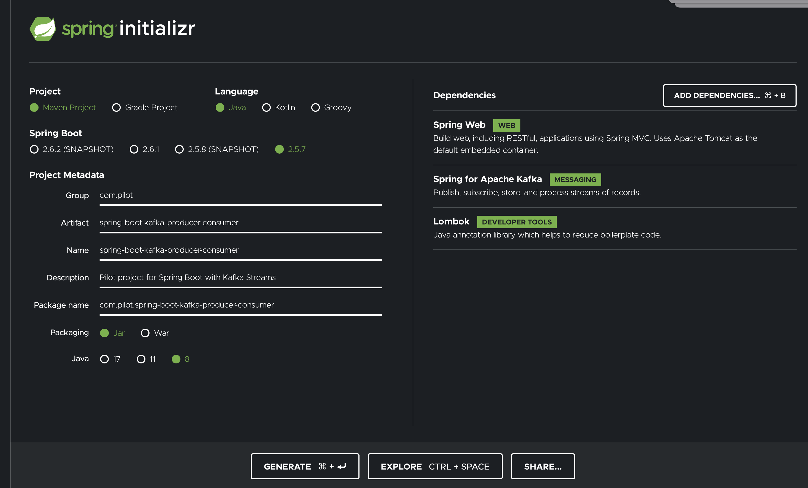

# Common HowTo's 

## Build initial spring project from Spring Inializer
Use bash to get your initial spring project from [start.spring.io]() following the Spring's User Guide for [Command line support](https://docs.spring.io/initializr/docs/0.4.x/reference/html/command-line.html)
```bash
  export PROJECT_NAME="spring-boot-kafka-producer-consumer"
  curl https://start.spring.io/starter.zip \
    -d dependencies=web,kafka,lombok \
    -d groupId="com.pilot" \
    -d artifactId=$PROJECT_NAME \
    -d name=$PROJECT_NAME \
    -d description="Pilot project for Spring Boot with Kafka" \
    -d javaVersion=1.8 \
    -d bootVersion=2.5.6 -o $PROJECT_NAME.zip
```
Or use your browser at [start.spring.io](https://start.spring.io/)


##  Check the Dependency Tree
```bash
    mvn dependency:tree

    [INFO] Scanning for projects...
    [INFO]
    [INFO] -----------< com.pilot:spring-boot-kafka-producer-consumer >------------
    [INFO] Building spring-boot-kafka-producer-consumer 0.0.1-SNAPSHOT
    [INFO] --------------------------------[ jar ]---------------------------------
    [INFO]
    [INFO] --- maven-dependency-plugin:3.1.2:tree (default-cli) @ spring-boot-kafka-producer-consumer ---    
    Downloaded from central: ...
    [INFO] com.pilot:spring-boot-kafka-producer-consumer:jar:0.0.1-SNAPSHOT
    [INFO] +- org.springframework.boot:spring-boot-starter-web:jar:2.5.6:compile
    [INFO] |  +- org.springframework.boot:spring-boot-starter:jar:2.5.6:compile
    [INFO] |  |  +- org.springframework.boot:spring-boot:jar:2.5.6:compile
    [INFO] |  |  +- org.springframework.boot:spring-boot-autoconfigure:jar:2.5.6:compile
    [INFO] |  |  +- org.springframework.boot:spring-boot-starter-logging:jar:2.5.6:compile
    [INFO] |  |  |  +- ch.qos.logback:logback-classic:jar:1.2.6:compile
    [INFO] |  |  |  |  \- ch.qos.logback:logback-core:jar:1.2.6:compile
    [INFO] |  |  |  +- org.apache.logging.log4j:log4j-to-slf4j:jar:2.14.1:compile
    [INFO] |  |  |  |  \- org.apache.logging.log4j:log4j-api:jar:2.14.1:compile
    [INFO] |  |  |  \- org.slf4j:jul-to-slf4j:jar:1.7.32:compile
    [INFO] |  |  +- jakarta.annotation:jakarta.annotation-api:jar:1.3.5:compile
    [INFO] |  |  \- org.yaml:snakeyaml:jar:1.28:compile
    [INFO] |  +- org.springframework.boot:spring-boot-starter-json:jar:2.5.6:compile
    [INFO] |  |  +- com.fasterxml.jackson.core:jackson-databind:jar:2.12.5:compile
    [INFO] |  |  |  \- com.fasterxml.jackson.core:jackson-annotations:jar:2.12.5:compile
    [INFO] |  |  +- com.fasterxml.jackson.datatype:jackson-datatype-jdk8:jar:2.12.5:compile
    [INFO] |  |  +- com.fasterxml.jackson.datatype:jackson-datatype-jsr310:jar:2.12.5:compile
    [INFO] |  |  \- com.fasterxml.jackson.module:jackson-module-parameter-names:jar:2.12.5:compile
    [INFO] |  +- org.springframework.boot:spring-boot-starter-tomcat:jar:2.5.6:compile
    [INFO] |  |  +- org.apache.tomcat.embed:tomcat-embed-core:jar:9.0.54:compile
    [INFO] |  |  +- org.apache.tomcat.embed:tomcat-embed-el:jar:9.0.54:compile
    [INFO] |  |  \- org.apache.tomcat.embed:tomcat-embed-websocket:jar:9.0.54:compile
    [INFO] |  +- org.springframework:spring-web:jar:5.3.12:compile
    [INFO] |  |  \- org.springframework:spring-beans:jar:5.3.12:compile
    [INFO] |  \- org.springframework:spring-webmvc:jar:5.3.12:compile
    [INFO] |     +- org.springframework:spring-aop:jar:5.3.12:compile
    [INFO] |     \- org.springframework:spring-expression:jar:5.3.12:compile
    [INFO] +- org.springframework.kafka:spring-kafka:jar:2.7.8:compile
    [INFO] |  +- org.springframework:spring-context:jar:5.3.12:compile
    [INFO] |  +- org.springframework:spring-messaging:jar:5.3.12:compile
    [INFO] |  +- org.springframework:spring-tx:jar:5.3.12:compile
    [INFO] |  +- org.springframework.retry:spring-retry:jar:1.3.1:compile
    [INFO] |  +- org.apache.kafka:kafka-clients:jar:2.7.1:compile
    [INFO] |  |  +- com.github.luben:zstd-jni:jar:1.4.5-6:compile
    [INFO] |  |  +- org.lz4:lz4-java:jar:1.7.1:compile
    [INFO] |  |  +- org.xerial.snappy:snappy-java:jar:1.1.7.7:compile
    [INFO] |  |  \- org.slf4j:slf4j-api:jar:1.7.32:compile
    [INFO] |  \- com.google.code.findbugs:jsr305:jar:3.0.2:runtime
    [INFO] +- org.projectlombok:lombok:jar:1.18.22:compile
    [INFO] +- org.springframework.boot:spring-boot-starter-test:jar:2.5.6:test
    [INFO] |  +- org.springframework.boot:spring-boot-test:jar:2.5.6:test
    [INFO] |  +- org.springframework.boot:spring-boot-test-autoconfigure:jar:2.5.6:test
    [INFO] |  +- com.jayway.jsonpath:json-path:jar:2.5.0:test
    [INFO] |  |  \- net.minidev:json-smart:jar:2.4.7:test
    [INFO] |  |     \- net.minidev:accessors-smart:jar:2.4.7:test
    [INFO] |  |        \- org.ow2.asm:asm:jar:9.1:test
    [INFO] |  +- jakarta.xml.bind:jakarta.xml.bind-api:jar:2.3.3:compile
    [INFO] |  |  \- jakarta.activation:jakarta.activation-api:jar:1.2.2:compile
    [INFO] |  +- org.assertj:assertj-core:jar:3.19.0:test
    [INFO] |  +- org.hamcrest:hamcrest:jar:2.2:test
    [INFO] |  +- org.junit.jupiter:junit-jupiter:jar:5.7.2:test
    [INFO] |  |  +- org.junit.jupiter:junit-jupiter-params:jar:5.7.2:test
    [INFO] |  |  \- org.junit.jupiter:junit-jupiter-engine:jar:5.7.2:test
    [INFO] |  |     \- org.junit.platform:junit-platform-engine:jar:1.7.2:test
    [INFO] |  +- org.mockito:mockito-core:jar:3.9.0:test
    [INFO] |  |  +- net.bytebuddy:byte-buddy:jar:1.10.22:test
    [INFO] |  |  +- net.bytebuddy:byte-buddy-agent:jar:1.10.22:test
    [INFO] |  |  \- org.objenesis:objenesis:jar:3.2:test
    [INFO] |  +- org.mockito:mockito-junit-jupiter:jar:3.9.0:test
    [INFO] |  +- org.skyscreamer:jsonassert:jar:1.5.0:test
    [INFO] |  |  \- com.vaadin.external.google:android-json:jar:0.0.20131108.vaadin1:test
    [INFO] |  +- org.springframework:spring-core:jar:5.3.12:compile
    [INFO] |  |  \- org.springframework:spring-jcl:jar:5.3.12:compile
    [INFO] |  +- org.springframework:spring-test:jar:5.3.12:test
    [INFO] |  \- org.xmlunit:xmlunit-core:jar:2.8.3:test
    [INFO] +- org.springframework.kafka:spring-kafka-test:jar:2.7.8:test
    [INFO] |  +- org.apache.kafka:kafka-clients:jar:test:2.7.1:test
    [INFO] |  +- org.apache.kafka:kafka-streams:jar:2.7.1:test
    [INFO] |  |  +- org.apache.kafka:connect-json:jar:2.7.1:test
    [INFO] |  |  |  \- org.apache.kafka:connect-api:jar:2.7.1:test
    [INFO] |  |  \- org.rocksdb:rocksdbjni:jar:5.18.4:test
    [INFO] |  +- org.apache.kafka:kafka-streams-test-utils:jar:2.7.1:test
    [INFO] |  +- org.apache.kafka:kafka_2.13:jar:2.7.1:test
    [INFO] |  |  +- org.apache.kafka:kafka-raft:jar:2.7.1:test
    [INFO] |  |  +- com.fasterxml.jackson.module:jackson-module-scala_2.13:jar:2.12.5:test
    [INFO] |  |  |  \- com.thoughtworks.paranamer:paranamer:jar:2.8:test
    [INFO] |  |  +- com.fasterxml.jackson.dataformat:jackson-dataformat-csv:jar:2.12.5:test
    [INFO] |  |  +- net.sf.jopt-simple:jopt-simple:jar:5.0.4:test
    [INFO] |  |  +- com.yammer.metrics:metrics-core:jar:2.2.0:test
    [INFO] |  |  +- org.scala-lang.modules:scala-collection-compat_2.13:jar:2.2.0:test
    [INFO] |  |  +- org.scala-lang.modules:scala-java8-compat_2.13:jar:0.9.1:test
    [INFO] |  |  +- org.scala-lang:scala-library:jar:2.13.3:test
    [INFO] |  |  +- org.scala-lang:scala-reflect:jar:2.13.3:test
    [INFO] |  |  +- com.typesafe.scala-logging:scala-logging_2.13:jar:3.9.2:test
    [INFO] |  |  +- org.apache.zookeeper:zookeeper:jar:3.5.9:test
    [INFO] |  |  |  +- org.apache.zookeeper:zookeeper-jute:jar:3.5.9:test
    [INFO] |  |  |  +- org.apache.yetus:audience-annotations:jar:0.5.0:test
    [INFO] |  |  |  +- io.netty:netty-handler:jar:4.1.69.Final:test
    [INFO] |  |  |  |  +- io.netty:netty-common:jar:4.1.69.Final:test
    [INFO] |  |  |  |  +- io.netty:netty-resolver:jar:4.1.69.Final:test
    [INFO] |  |  |  |  +- io.netty:netty-buffer:jar:4.1.69.Final:test
    [INFO] |  |  |  |  +- io.netty:netty-transport:jar:4.1.69.Final:test
    [INFO] |  |  |  |  \- io.netty:netty-codec:jar:4.1.69.Final:test
    [INFO] |  |  |  \- io.netty:netty-transport-native-epoll:jar:4.1.69.Final:test
    [INFO] |  |  |     \- io.netty:netty-transport-native-unix-common:jar:4.1.69.Final:test
    [INFO] |  |  \- commons-cli:commons-cli:jar:1.4:test
    [INFO] |  +- org.apache.kafka:kafka_2.13:jar:test:2.7.1:test
    [INFO] |  \- org.junit.jupiter:junit-jupiter-api:jar:5.7.2:test
    [INFO] |     +- org.apiguardian:apiguardian-api:jar:1.1.0:test
    [INFO] |     +- org.opentest4j:opentest4j:jar:1.2.0:test
    [INFO] |     \- org.junit.platform:junit-platform-commons:jar:1.7.2:test
    [INFO] \- org.springdoc:springdoc-openapi-ui:jar:1.5.2:compile
    [INFO]    +- org.springdoc:springdoc-openapi-webmvc-core:jar:1.5.2:compile
    [INFO]    |  \- org.springdoc:springdoc-openapi-common:jar:1.5.2:compile
    [INFO]    |     +- io.swagger.core.v3:swagger-models:jar:2.1.6:compile
    [INFO]    |     +- io.swagger.core.v3:swagger-annotations:jar:2.1.6:compile
    [INFO]    |     +- io.swagger.core.v3:swagger-integration:jar:2.1.6:compile
    [INFO]    |     |  \- io.swagger.core.v3:swagger-core:jar:2.1.6:compile
    [INFO]    |     |     +- com.fasterxml.jackson.dataformat:jackson-dataformat-yaml:jar:2.12.5:compile
    [INFO]    |     |     \- jakarta.validation:jakarta.validation-api:jar:2.0.2:compile
    [INFO]    |     +- io.github.classgraph:classgraph:jar:4.8.69:compile
    [INFO]    |     \- org.apache.commons:commons-lang3:jar:3.12.0:compile
    [INFO]    +- org.webjars:swagger-ui:jar:3.38.0:compile
    [INFO]    \- org.webjars:webjars-locator-core:jar:0.46:compile
    [INFO]       \- com.fasterxml.jackson.core:jackson-core:jar:2.12.5:compile
    [INFO] ------------------------------------------------------------------------
    [INFO] BUILD SUCCESS
    [INFO] ------------------------------------------------------------------------
    [INFO] Total time:  6.512 s
    [INFO] Finished at: 2021-12-16T14:49:29+02:00
    [INFO] ------------------------------------------------------------------------
```